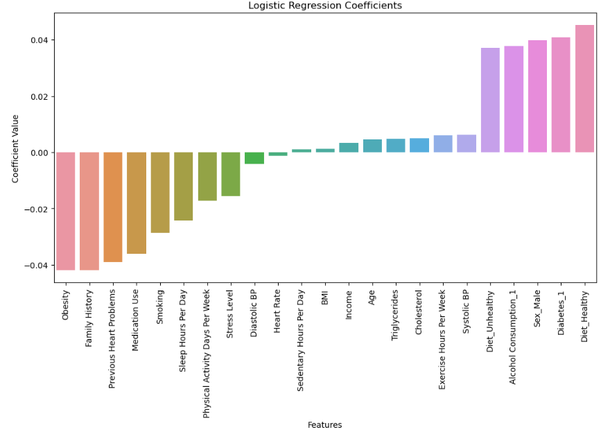

# Heart-Attack-Prediction
What are the leading risk factors of a heart attack based on the analyzed dataset?

## Heart Attacks: An Overview of the Causes and Consequences
According to the Center for Disease Control and Prevention (CDC), heart disease is the leading cause of death for women and men in the United States. The conditions that fall under heart disease account for the causes of heart attacks -- primarily the clogging of arteries, which carry oxygen-rich blood from the heart to the rest of the body. The chances that someone will develop heart disease or have a heart attack are reliant on a number of factors such as physical inactivity, tobacco use and air pollution, among others. 
### Importance
Every 40 seconds, someone in the United States dies of a heart attack, which amounts to about 805,000 people a year. Because of its great contribution to mortality in the United States, the causes of heart disease -- and more specifically, heart attacks -- are worth studying. Discovering the underlying predictors that put people more at risk of developing heart disease or having a heart attack allows us to minimize their prevalence and thus eliminate their deadliness.


__Figure 1:__ "As plaque builds up in the arteries of a person with heart disease, the inside of the arteries begins to narrow, which lessens or blocks the flow of blood" (CDC). This restriction of blood flow to the heart is the primary cause of a heart attack. 

*Source: [CDC](https://www.cdc.gov/heart-disease/data-research/facts-stats/index.html#:~:text=Heart%20disease%20is%20the%20leading,people%20died%20from%20heart%20disease.), [WHO](https://www.who.int/health-topics/cardiovascular-diseases#tab=tab_1)*
## Dataset: [Heart Attack Risk Prediction Dataset](https://www.kaggle.com/datasets/iamsouravbanerjee/heart-attack-prediction-dataset)
The analyzed dataset was chosen from kaggle.com due to its extensive list of potential causation variables. Although synthetically-generated by ChatGPT, the dataset mirrors real-world data and was created for others to use in their exploration of various data modeling techniques. The data includes 8763 data points of patient data across 26 variables including demographic and health habit variables.
### Variables
For the purposes of this project, the following variables were analyzed:
| Variable Name   | Description                              | Type     | Default Value |
|-----------------|------------------------------------------|----------|---------------|
| `Diabetes`| Whether the patient has diabetes | `number` | `1: Yes, 0: No` |
| `Family.History`| Family history of heart-related problem | `number` | `1: Yes, 0: No` |
| `Smoking`| Smoking status of the patient | `number` | `1: Yes, 0: No` |
| `Obesity`| Obesity status of the patient | `number` | `1: Yes, 0: No` |
| `Previous.Heart.Problems`| Previous heart problems of the patient | `number` | `1: Yes, 0: No` |
| `Medication.Use`| Medication usage by the patient | `number` | `1: Yes, 0: No` |
| `Heart Attack Risk`| Presence of heart attack risk | `number` | `1: Yes, 0: No` |

## How to Run the Code

### Logistic Regression Model with CV (Python)
1. **Download the Dataset:**  
   Download the dataset from [Kaggle](https://www.kaggle.com/datasets/iamsouravbanerjee/heart-attack-prediction-dataset)

2. **Update the File Path:**  
   In the `Log_Regression.py` script, replace the file path in the following line with the location where you saved the dataset:
   ```
   df = pd.read_csv("C:\\Users\\SamJutes\\Downloads\\heart_attack_prediction_dataset.csv")
   
3. **Run the Script:**
  Execute the Log_Regression.py file in your Python environment.

### Feedforward Neural Network Model (R)
1. **Download the Dataset:**  
   Download the dataset from [Kaggle](https://www.kaggle.com/datasets/iamsouravbanerjee/heart-attack-prediction-dataset)

2. **Update the File Path:**  
   In the `FFN.Rmd` script, replace the file path in the following line with the location where you saved the dataset:
   ```
   Prediction <- read.csv("/Users/colint./Desktop/Working Directory/Prediction.csv")

4. **Run the Script:**
  Open the FFN.Rmd file in RStudio or your preferred R environment and run the code.


## Method 1: Logistic Regression
Logistic regression is a good choice because our target variable, heart attack risk, is binary. It also provides clear insights into how each factor affects heart attack risk. For example, if smoking has a high positive coefficient, it means smoking increases the risk. As it is highly interpretable in that sense. 

In our dataset, we had to one-hot encode variables like 'Sex', 'Diabetes', 'Alcohol Consumption', and 'Diet' to transform them into a numerical format suitable for logistic regression. Logistic regression requires numeric inputs so one-hot encoding allows us to represent categorical variables without imposing any ordinal relationships between them.

We also split the 'Blood Pressure' variable into two columns: 'Systolic BP' and 'Diastolic BP'. This is because 'Blood Pressure' was originally stored as a string (e.g., "120/80"), and logistic regression requires numerical inputs. By splitting it, we can represent each value as an integer, making it easier to include as a feature in the model.

Logistic regression doesn’t need much computing power, which makes it practical for a dataset of 8,763 patients. To ensure the model's effectiveness, we removed certain columns, such as 'Patient ID', 'Country', 'Continent', and 'Hemisphere'. These columns don’t contribute to predicting heart attack risk and may introduce noise into the model. 'Patient ID' is a unique identifier and irrelevant to risk factors, while 'Country', 'Continent', and 'Hemisphere' may not have a direct relationship with heart attack risk.

We found that there was a class imbalance (more data on no heart risk than heart attack risk) made the model biased towards no heart attack risk. To address this, we used SMOTETomek for resampling. This technique generates synthetic data for the minority class and removes overlapping instances, leading to a more balanced dataset so that the model is less biased.

Feature scaling was applied using StandardScaler. Logistic regression can be sensitive to features with different scales, and scaling the features ensures that all predictors contribute equally to the model. It also helps the model converge faster during training, making the process more efficient.

It is also important to mention the assumptions we made before using this modeling approach:
* The observations in the dataset are independent of each other
* The data does not have extreme values that could influence the model
* The independent variables are not highly correlated with each other

### Code
[Logistic Regression Model Script](code/Log_Regression.py)


### Results
The logistic regression model achieved 67% accuracy. The confusion matrix showed that the model correctly identified 333 true negatives and 312 true positives. It misclassified 155 false positives and 169 false negatives.

The model also helped identify key risk factors by looking at the coefficients. A positive coefficient means the factor increases heart attack risk, and a negative coefficient means it lowers the risk.



Positive risk factors:

* Diet: Surprisingly, a healthy diet was the strongest predictor for heart attack risk in this model.
* Diabetes: Having diabetes increased the risk
* Sex_Male: Being male also increased the risk
* Alcohol Consumption: Alcohol use was positively linked to heart attack risk.

Negative risk factors:

* Obesity:  linked to a lower risk of heart attack in this model.
* Family History: linked to a lower risk
* Previous Heart Problems: Having previous heart problems was associated with a lower risk of heart attack
* Medication Use: Medication use was also negatively correlated with heart attack risk.

The model’s performance was also evaluated using precision, recall, and F1-score, all of which were around 0.66, indicating balanced performance across both classes.


## Method 2: Feedforward Neural Network
Feedforward neural networks are used in the medical field for cardiovascular diseases, cancer detection, and image analysis. The primary goal of this project is to determine what factors are most likely to cause a heart attack or myocardial infarction. There were many variables presented in the dataset, but many were not in a binary form. Any variables not in binary form were removed for this part of the analysis. The variables that were considered are 'Diabetes', 'Family history', 'Smoking', 'Obesity', 'Previous Heart Problems', and 'Medication use'. 

The main reason for the exclusion stems from the computational power needed for nerual network models. The dataset consisted of 8,763 patients, which makes the neural network a good tool to use. This is because neural networks work best when there is large amounts of data. Unfortunately, large amounts of data and the overall complexity of the model means creating and running a neural network is computationally taxing. 

Another aspect worth mentioning is that while nueral networks allow for complex data to be analyzed, the output is difficult to analyze. 

### Code
[Feedfoward Network Model Script](code/FFN.Rmd)

### Results


The above image shows the produced neural network from the code. The input variables, hidden layer, and output layer are all shown. 

A confusion matrix was used to evaluate model accuracy. From it, the model had a 36% accuracy, a precision rate of 36%, and an F1 score of 53%. The model was able to correctly predict an outcome 36% of the time, corectly identify the positive class 36% of the time, but has a high F1 score of 53%. The F1 score takes into account the model's recall and precision, meaning the model's recall increased the F1 score, as the precision rate was low. The results are contradictory, and should be further looked into.  

### Results
## Cross Validation 
### Method 1: Logistic Regression
We used LogisticRegressionCV from scikit-learn which automatically performs cross-validation with the Logistic regression. It splits the dataset into subsets, trains the model on some, and tests it on others. It does this multiple times to find the best regularization value, C, which helps prevent overfitting. The best C value for this model was found to be 0.001. 

We chose cross validation for a couple reasons:

* Reliability: It provides more reliable results than a single train-test split
* Computational expense:  Less computationally expensive than methods like LOOCV
* Generalization: It helps ensure the model performs well on different data, not just a single subset. This is especially important in medical data where accuracy is critical.
  
## Conclusions
The logistic regression model achieved a 67% accuracy in predicting heart attack risk. While the model identified several key risk factors, some of the results were counterintuitive. Obesity and a family history of heart disease were unexpectedly linked to a lower risk of heart attack, which suggests that other factors may be influencing these relationships.

However, the model's balanced performance in terms of precision, recall, and F1-score suggests that it is reasonably effective for the task. Further analysis is needed to understand the counterintuitive results.

The feedfoward neural network model achieved a 36% accuracy in predicting heart attack risk. The model is shown to have contradictory results. This is seen with the accuracy score aand F1 score. Despite the low accruacy, the model could be fine tuned to produce more desirable results. 

## Suggestions for Future Analysis
# Logistic Regression:
Although the logistic model did not have the best performance, it could be improved by making some adjustments. Given more time, we would try different combinations of variables. For example: 
* Test different sets of features: We would experiment with different combinations of variables, like using just lifestyle factors (Diet, Alcohol Consumption) or combining health-related factors (Blood Pressure, Diabetes, etc.) to see which ones help the model predict heart attack risk better.
* Look for interactions: Some features might work better together. For example, combining age with blood pressure or diet with exercise might give the model better insights.
* Check for relationships: It was assumed that the independent variables are not highly correlated with each other, which may not be true. I would check how different variables are related to each other and the outcome. If two variables are very similar, we might keep one and remove the other to make the model simpler.


## Credits
* Amber Castro -
* Colin Taylor - Feedfoward Neural Network (background, code, results, conclusions, suggestions)
* Samantha Juteram - Logistic model (background, code, results, conclusions, suggestions), Cross Validation
